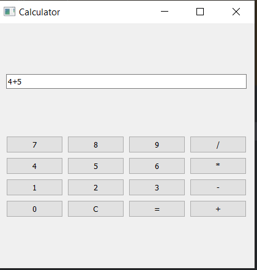
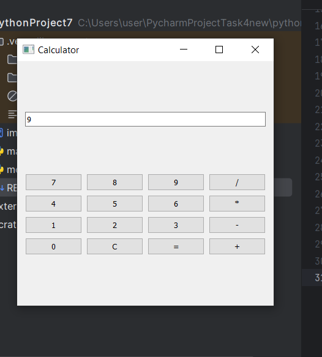

# PyQt5 Calculator (MVC Pattern)

## Description
This project implements a simple calculator using PyQt5, following the Model-View-Controller (MVC) architectural pattern.

## Installation
1. Install dependencies:
   ```sh
   pip install PyQt5
   
python main.py
File Structure
model.py - Calculator logic (Model)
main.py - Graphical interface and control (View + Controller)
README.md - Project documentation
Features
Supports basic arithmetic operations (+, -, *, /).
Handles errors (division by zero and invalid input).
User-friendly graphical interface with buttons (0-9, C, =, +, -, *, /).
Example Usage
Input:
5 + 3 * 2
Output:
11
Input:
10 / 0
Output:
vbnet
Error: Division by zero

